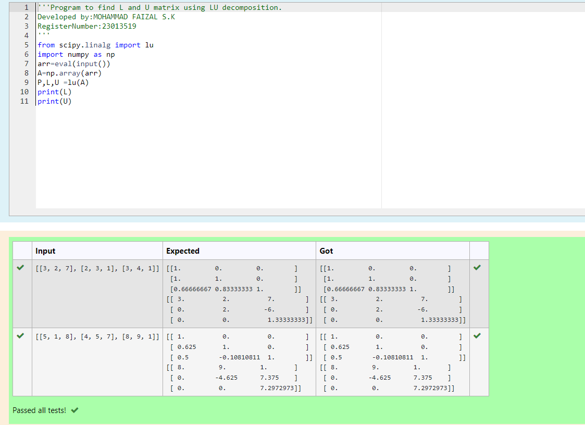
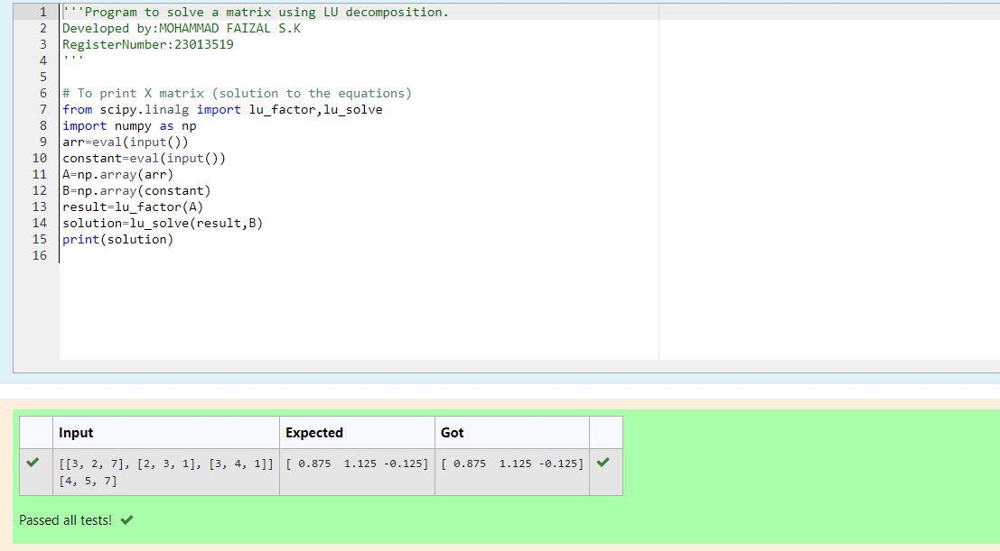

# LU Decomposition 

## AIM:
To write a program to find the LU Decomposition of a matrix.

## Equipments Required:
1. Hardware – PCs
2. Anaconda – Python 3.7 Installation / Moodle-Code Runner

## Algorithm
1. Define the package as scipy.linalg import lu.
2. Get input from user and print L and U matrix by 'print' .
3. Define a package as "from scipy.linalg import lu_factor, lu_solve" and create the variable as 'X' include the package in that variable.
4. print the variable 'X'

## Program:
(i) To find the L and U matrix
```py
'''Program to find L and U matrix using LU decomposition.
Developed by:MOHAMMAD FAIZAL S.K 
RegisterNumber:23013519 
'''
from scipy.linalg import lu
import numpy as np
arr=eval(input())
A=np.array(arr)
P,L,U =lu(A)
print(L)
print(U)
```
(ii) To find the LU Decomposition of a matrix
```py
'''Program to solve a matrix using LU decomposition.
Developed by:MOHAMMAD FAIZAL S.K
RegisterNumber:23013519
'''

# To print X matrix (solution to the equations)
from scipy.linalg import lu_factor,lu_solve
import numpy as np
arr=eval(input())
constant=eval(input())
A=np.array(arr)
B=np.array(constant)
result=lu_factor(A)
solution=lu_solve(result,B)
print(solution)

```

## Output:




## Result:
Thus the program to find the LU Decomposition of a matrix is written and verified using python programming.

